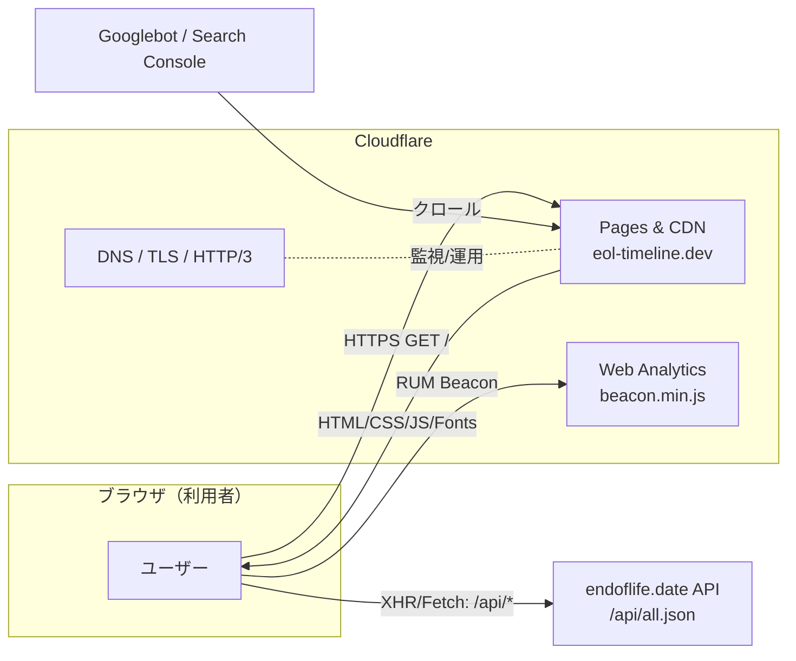

# EOL Timeline

## システム構成

```mermaid
flowchart LR
  subgraph Client["ブラウザ（利用者）"]
    U[ユーザー]
  end

  subgraph CF["Cloudflare"]
    DNS[DNS / TLS / HTTP/3]
    CDN[Pages & CDN<br/>eol-timeline.dev]
    WA[Web Analytics<br/>beacon.min.js]
  end

  EOL[endoflife.date API<br/>/api/all.json]
  GSC[Googlebot / Search Console]

  %% 結線
  U -->|HTTPS GET /| CDN
  CDN -->|HTML/CSS/JS/Fonts| U
  U -->|XHR/Fetch: /api/*| EOL
  U -->|RUM Beacon| WA

  GSC -->|クロール| CDN

  %% 内部配線
  DNS -. 監視/運用 .- CDN
```
